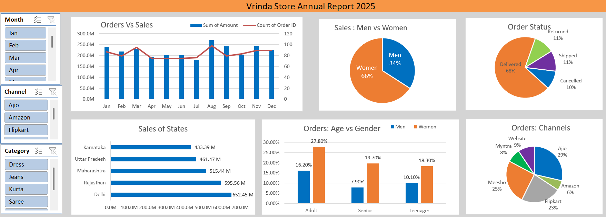

# 📊 Vrinda Store Annual Report 2025

## 📌 Project Overview
This project is an interactive Excel dashboard built to analyze the annual sales performance of Vrinda Store for the year 2025. It converts raw sales data into meaningful business insights using Advanced Excel features.

## 🎯 Objective
- Analyze sales performance across different months.
- Identify top-performing states and sales channels.
- Understand customer demographics and order status.
- Support business decision-making through data visualization.

## 🛠️ Tools & Skills Used
- Microsoft Excel
- Pivot Tables
- Pivot Charts
- Slicers
- Data Cleaning
- Data Validation
- Excel Functions
- Dashboard Design
- Data Visualization

## 📈 Dashboard Insights
- Monthly Orders vs Sales
- Sales: Men vs Women
- Order Status Analysis
- State-wise Sales Performance
- Orders by Age & Gender
- Orders by Sales Channel
- Interactive Filters (Month, Channel, Category)

## 💡 Key Business Insights
- Women customers contributed more sales than men.
- Delivered orders accounted for the highest percentage of total orders.
- Maharashtra and Delhi generated the highest sales.
- Adult customers placed the maximum number of orders.
- Amazon, Flipkart, and Meesho were among the top sales channels.

## 📷 Dashboard Preview

## 📂 Project Files
- Vrinda_Store_Report_2025.xlsx
- Dashboard.png
- README.md

## 🚀 Skills Demonstrated
- Data Cleaning
- Data Validation
- Pivot Table Analysis
- Dashboard Development
- Business Intelligence
- Data Visualization
- Excel Reporting

## 👨‍💻 Author
*Aryan Rajput*

⭐ If you like this project, don't forget to star this repository.
